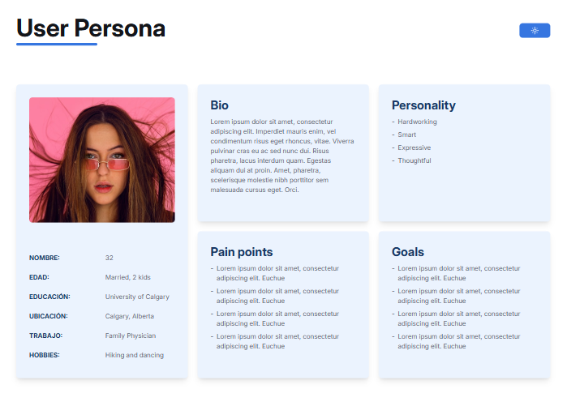
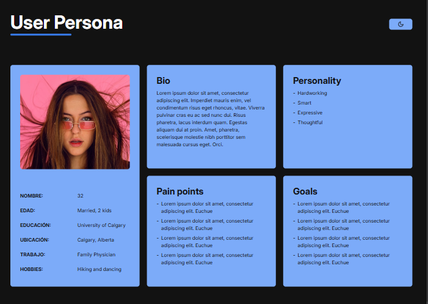
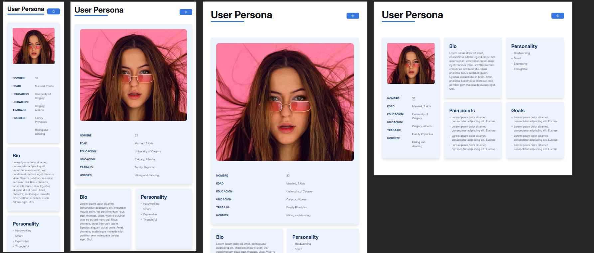
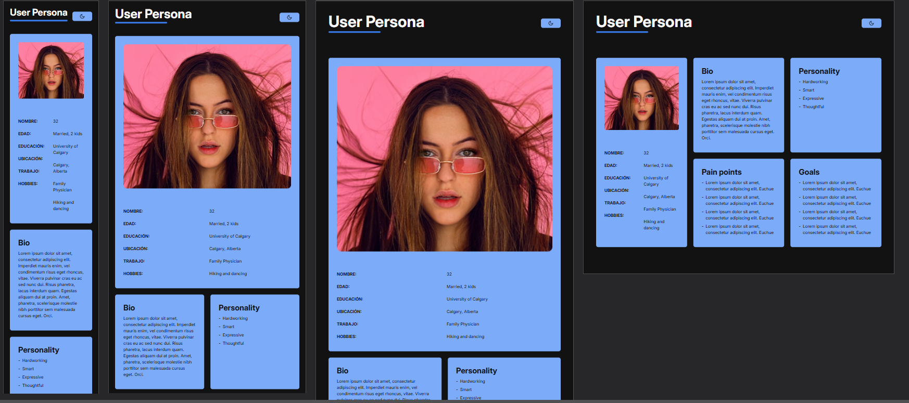

# P5.2 Diseñar con Tailwind y React Router una página responsiva y modo noche
Realizado por:
- **Daniel Marín Moraleda**

## Enlaces

- **Repositorio en GitHub**: [Github](https://github.com/danielMarmo/Dacas-daniel-lucas)
- **Demo en Vivo**: No he podido desplegar el proyecto en vercel, por lo que adjunto capturas al final

### Instalacion 

Instalar dependencias:

```bash
npm i
```

### Despliegue

Despliega el proyecto mediante:

```bash
npm run dev
```

Tu aplicacion se encontrara disponible en `http://localhost:5173`.

## Tecnologías Utilizadas

- **React Router**: Estructura y contenido básico del sitio web.
- **Tailwind**: Estilización visual de las páginas.
- **Vite**: Herramienta de construcción para mejorar el flujo de trabajo de desarrollo.

## Descripción

Creacion de un proyecto basandonos en un diseño proporcionado en Figma utilizando React Router, creando los componentes necesarios y asegurando la funcionalidad del modo noche utilizando Tailwind CSS.

Asi se ve en tamaño normal en los dos modos




Y asi se veria resonsivo en el resto de dispositivos en ambos modos

